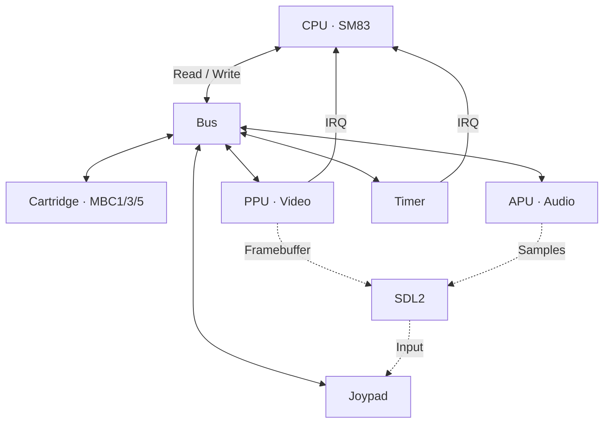

# GameBoy Emulator

A Game Boy (DMG) emulator written in C++23.

## Architecture



`GameBoy::Step()` calls `CPU::Step()`, then ticks Timer, PPU and APU. Interrupts raised by Timer/PPU are dispatched by the CPU on the next step.

### Memory Map

| Address | Component | Description |
|---------|-----------|-------------|
| `0x0000–0x7FFF` | Cartridge | ROM banks |
| `0x8000–0x9FFF` | PPU | Video RAM |
| `0xA000–0xBFFF` | Cartridge | External RAM |
| `0xC000–0xDFFF` | Bus | Work RAM |
| `0xFE00–0xFE9F` | PPU | OAM (sprites) |
| `0xFF00` | Joypad | Input register |
| `0xFF04–0xFF07` | Timer | DIV, TIMA, TMA, TAC |
| `0xFF10–0xFF3F` | APU | Sound registers |
| `0xFF40–0xFF4B` | PPU | LCD registers |
| `0xFF80–0xFFFE` | Bus | High RAM |
| `0xFFFF` | Bus | Interrupt Enable |

## Features

### Implemented
- [x] Full SM83 CPU (all instructions + CB prefix)
- [x] PPU with background, window and sprites
- [x] Timer and interrupts (VBlank, STAT, Timer, Joypad)
- [x] Joypad (keyboard input)
- [x] MBC1, MBC3, MBC5 (ROM/RAM banking)
- [x] 4-channel APU (2 square, wave, noise)
- [x] SDL2 rendering and audio

### TODO
- [x] Battery-backed RAM (game saves)
- [x] RTC (Real Time Clock) for MBC3
- [x] Save states (F5 save, F8 load)
- [ ] Game Boy Color (CGB) — double speed, palettes, VRAM banking
- [ ] Serial link
- [x] Cycle-accurate timing

### Controls
| Key | GB Button |
|-----|-----------|
| Arrow keys | D-Pad |
| Z | A |
| X | B |
| Enter | Start |
| RShift | Select |
| F5 | Save state |
| F8 | Load state |
| Escape | Quit |

## Prerequisites

- CMake 3.20+
- C++23 compiler (MSVC 2022, GCC 13+, Clang 17+)
- vcpkg

## Setup

```bash
# Clone vcpkg (if not already done)
git clone https://github.com/Microsoft/vcpkg.git
cd vcpkg && bootstrap-vcpkg.bat  # Windows
cd vcpkg && ./bootstrap-vcpkg.sh # Linux/Mac

# Set VCPKG_ROOT
# Windows: setx VCPKG_ROOT "C:\path\to\vcpkg"
# Linux/Mac: export VCPKG_ROOT="/path/to/vcpkg"
```

## Build

```bash
cmake --preset default
cmake --build build/debug
```

## Test ROMs

Download Blargg's test ROMs:
```bash
git clone https://github.com/retrio/gb-test-roms.git test-roms
```

## Blargg Tests

```
cpu_instrs/01-special.gb        PASSED
cpu_instrs/02-interrupts.gb     PASSED
cpu_instrs/03-op sp,hl.gb       PASSED
cpu_instrs/04-op r,imm.gb       PASSED
cpu_instrs/05-op rp.gb          PASSED
cpu_instrs/06-ld r,r.gb         PASSED
cpu_instrs/07-jr,jp,call,ret    PASSED
cpu_instrs/08-misc instrs.gb    PASSED
cpu_instrs/09-op r,r.gb         PASSED
cpu_instrs/10-bit ops.gb        PASSED
cpu_instrs/11-op a,(hl).gb      PASSED
instr_timing.gb                 PASSED
mem_timing/01-read_timing.gb    PASSED
mem_timing/02-write_timing.gb   PASSED
mem_timing/03-modify_timing.gb  PASSED
mem_timing.gb                   PASSED
halt_bug.gb                     PASSED
```

## Resources

- [Pan Docs](https://gbdev.io/pandocs/) — Technical documentation
- [Opcodes](https://gbdev.io/gb-opcodes/optables/) — Interactive opcode table
- [Homebrew Hub](https://hh.gbdev.io/) — Legal homebrew ROMs
