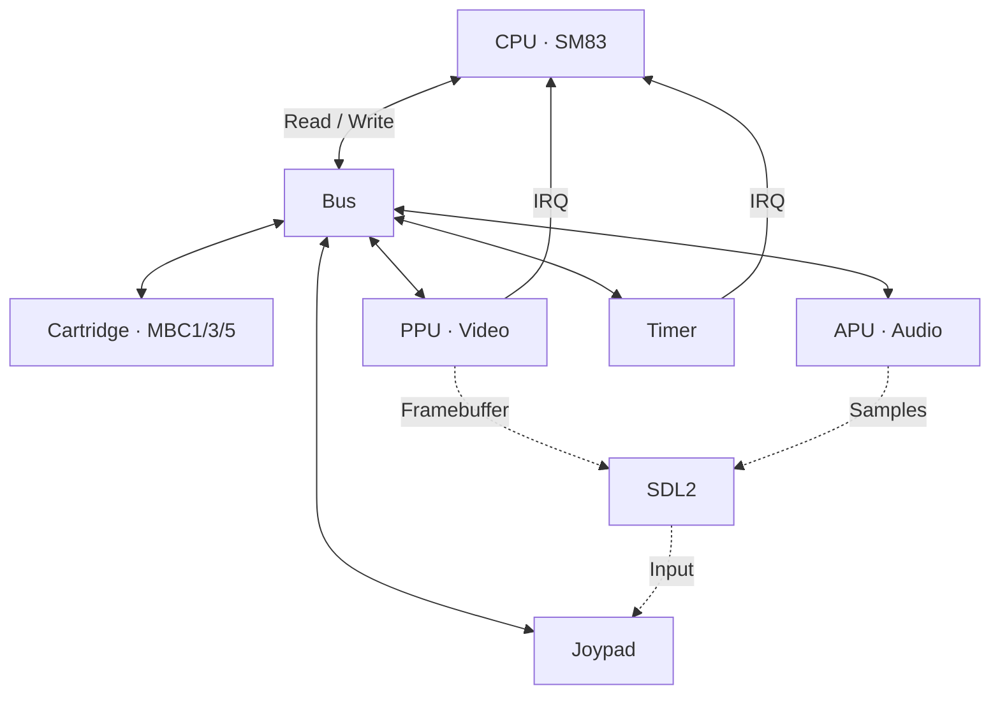

# Phosphor

Multi-system emulator written in C++23. Runs on Windows, Linux and Steam Deck.

## Supported Systems

### Game Boy / Game Boy Color

Full-featured Game Boy and Game Boy Color emulator.

#### Architecture



`GameBoy::Step()` calls `CPU::Step()`, then ticks Timer, PPU and APU. Interrupts raised by Timer/PPU are dispatched by the CPU on the next step.

#### Features

- Full SM83 CPU (all instructions + CB prefix)
- PPU with background, window and sprites
- Timer and interrupts (VBlank, STAT, Timer, Joypad)
- Joypad (keyboard + gamepad)
- MBC1, MBC3, MBC5 (ROM/RAM banking)
- 4-channel APU (2 square, wave, noise)
- Battery-backed RAM (game saves)
- RTC (Real Time Clock) for MBC3
- Save states (F5 save, F8 load)
- Game Boy Color (CGB) — double speed, color palettes, VRAM/WRAM banking, HDMA
- Serial link
- Cycle-accurate timing

#### Controls

##### Keyboard
| Key | Action |
|-----|--------|
| Arrow keys | D-Pad |
| Z | A |
| X | B |
| Enter | Start |
| RShift | Select |
| F5 | Save state |
| F8 | Load state |
| F11 | Toggle fullscreen |
| Escape | Quit |

##### Gamepad
| Button | Action |
|--------|--------|
| D-Pad | D-Pad |
| A / Cross | A |
| B / Circle | B |
| Start | Start |
| Back / Select | Select |
| LB / L1 | Save state |
| RB / R1 | Load state |
| Guide / Home | Toggle fullscreen |

## Project Structure

```
common/           Shared code (types, ROM selector, main entry point)
gameboy/          Game Boy emulator
ps1/              PlayStation (planned)
```

## Usage

```bash
Phosphor game.gb              # Launch a Game Boy ROM
Phosphor roms/                # Browse ROMs in a directory
Phosphor --fullscreen game.gbc  # Launch in fullscreen
Phosphor --test               # Run Blargg test suite
```

The emulator is detected automatically from the file extension (`.gb`/`.gbc` for Game Boy).

## Prerequisites

- CMake 3.20+
- C++23 compiler (MSVC 2022, GCC 13+, Clang 17+)
- vcpkg

## Setup

```bash
# Clone vcpkg (if not already done)
git clone https://github.com/Microsoft/vcpkg.git
cd vcpkg && bootstrap-vcpkg.bat  # Windows
cd vcpkg && ./bootstrap-vcpkg.sh # Linux/Mac

# Set VCPKG_ROOT
# Windows: setx VCPKG_ROOT "C:\path\to\vcpkg"
# Linux/Mac: export VCPKG_ROOT="/path/to/vcpkg"
```

## Build

```bash
cmake --preset default
cmake --build build/debug
```

## Blargg Tests

```
cpu_instrs/01-special.gb        PASSED
cpu_instrs/02-interrupts.gb     PASSED
cpu_instrs/03-op sp,hl.gb       PASSED
cpu_instrs/04-op r,imm.gb       PASSED
cpu_instrs/05-op rp.gb          PASSED
cpu_instrs/06-ld r,r.gb         PASSED
cpu_instrs/07-jr,jp,call,ret    PASSED
cpu_instrs/08-misc instrs.gb    PASSED
cpu_instrs/09-op r,r.gb         PASSED
cpu_instrs/10-bit ops.gb        PASSED
cpu_instrs/11-op a,(hl).gb      PASSED
instr_timing.gb                 PASSED
mem_timing/01-read_timing.gb    PASSED
mem_timing/02-write_timing.gb   PASSED
mem_timing/03-modify_timing.gb  PASSED
mem_timing.gb                   PASSED
halt_bug.gb                     PASSED
```

## Resources

- [Pan Docs](https://gbdev.io/pandocs/) — Game Boy technical documentation
- [Opcodes](https://gbdev.io/gb-opcodes/optables/) — Interactive opcode table
- [Homebrew Hub](https://hh.gbdev.io/) — Legal homebrew ROMs
