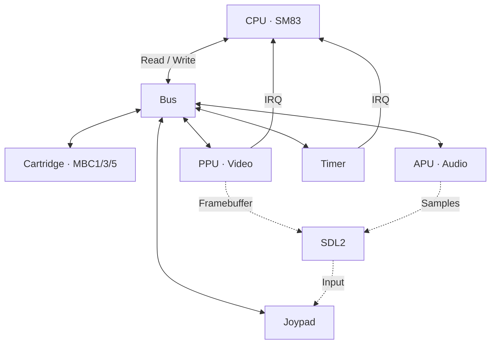

# Phosphor

Multi-system emulator written in C++23. Runs on Windows, Linux and Steam Deck.

## Systems

| System | Status |
|--------|--------|
| Game Boy / Game Boy Color | Playable |
| Game Boy Advance | In progress |
| PlayStation | Planned |

## Game Boy / Game Boy Color

Full-featured Game Boy and Game Boy Color emulator.

### Architecture



### Features

- Full SM83 CPU (all instructions + CB prefix)
- PPU with background, window and sprites
- Timer and interrupts (VBlank, STAT, Timer, Joypad)
- Joypad (keyboard + gamepad)
- MBC1, MBC3, MBC5 (ROM/RAM banking)
- 4-channel APU (2 square, wave, noise)
- Battery-backed RAM (game saves)
- RTC (Real Time Clock) for MBC3
- Save states (F5 save, F8 load)
- Game Boy Color — double speed, color palettes, VRAM/WRAM banking, HDMA
- Serial link
- Cycle-accurate timing

## Game Boy Advance

ARM7TDMI-based emulator, in development. CPU, memory map, PPU and cartridge skeletons are in place.

## Controls

### Keyboard
| Key | Action |
|-----|--------|
| Arrow keys | D-Pad |
| Z | A |
| X | B |
| Enter | Start |
| RShift | Select |
| F5 | Save state |
| F8 | Load state |
| F11 | Toggle fullscreen |
| Escape | Quit |

### Gamepad
| Button | Action |
|--------|--------|
| D-Pad | D-Pad |
| A / Cross | A |
| B / Circle | B |
| Start | Start |
| Back / Select | Select |
| LB / L1 | Save state |
| RB / R1 | Load state |
| Guide / Home | Toggle fullscreen |

## Project Structure

```
common/                     Shared code (types, ROM/system selector, entry point)
cores/
  gameboy/                  Game Boy / GBC emulator
  gameboy-advance/          GBA emulator (in progress)
  playstation1/             PlayStation (planned)
roms/
  gameboy/                  .gb / .gbc ROMs
  gameboy-advance/          .gba ROMs
  playstation1/             .bin / .cue / .iso
```

## Usage

```bash
Phosphor                        # System selector -> ROM selector
Phosphor game.gb                # Launch a Game Boy ROM directly
Phosphor game.gba               # Launch a GBA ROM directly
Phosphor --fullscreen game.gbc  # Launch in fullscreen
Phosphor --test                 # Run Blargg test suite
```

## Prerequisites

- CMake 3.20+
- C++23 compiler (MSVC 2022, GCC 13+, Clang 17+)
- vcpkg

## Build

```bash
cmake --preset default
cmake --build build/debug
```

Release build:
```bash
cmake --preset release
cmake --build build/release
```

## Blargg Tests (Game Boy)

All 16 tests passing:

```
cpu_instrs/01-special           PASSED
cpu_instrs/02-interrupts        PASSED
cpu_instrs/03-op sp,hl          PASSED
cpu_instrs/04-op r,imm          PASSED
cpu_instrs/05-op rp             PASSED
cpu_instrs/06-ld r,r            PASSED
cpu_instrs/07-jr,jp,call,ret    PASSED
cpu_instrs/08-misc instrs       PASSED
cpu_instrs/09-op r,r            PASSED
cpu_instrs/10-bit ops           PASSED
cpu_instrs/11-op a,(hl)         PASSED
instr_timing                    PASSED
mem_timing/01-read_timing       PASSED
mem_timing/02-write_timing      PASSED
mem_timing/03-modify_timing     PASSED
mem_timing                      PASSED
```

## Resources

- [Pan Docs](https://gbdev.io/pandocs/) — Game Boy technical documentation
- [GBATEK](https://problemkaputt.de/gbatek.htm) — GBA technical documentation
- [Opcodes](https://gbdev.io/gb-opcodes/optables/) — GB interactive opcode table
- [Homebrew Hub](https://hh.gbdev.io/) — Legal homebrew ROMs
